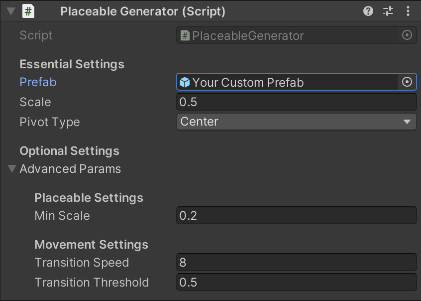
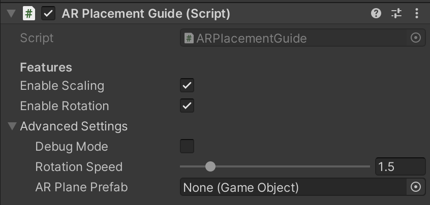

# Configuration

The two most important components of this package are the AR Placement Guide\* and the *Placeable Generator*. Both need to be on the same GameObject as the XR Origin.
It is best to check the sample scene for a working example.

{ width=400px , class="shaded"}
{ width=400px }

These two components contain most of the settings. In general your hierachy should look something like this:

{ width=400px, align=center }
{ width=200px, align=center, class="shaded" }

If you are not using the sample scene as a starting point, you will have to add the *AR Placement Guide* and the *Placeable Generator* to the XR Origin GameObject.
As well as *AR Kit Coaching Overlay* to the *AR Session* GameObject (though this is optional as it is an iOS only feature).

## Placeable Generator

### Using your own model/prefab

By replacing the *Prefab* on the *Placeable Generator* in the inspector you can use your own prefab.
Just drag in your model and everything should work out of the box. The transform inside the prefab will be preserved.
Use the scale setting to change the initial scale of the object. It can still be resized during run-time using gestures.

{ width=400px, align=center , class="shaded"}

This prefab should ideally only have a single *MeshRenderer* and a *MeshFilter* attached to it.

If your model is floating too high or is inside the ground, try to adjust the "Pivot Location" setting to match the pivot point position of your model.

A collider will also be added automatically. If you are unsure how to create a prefab, see the section below.
If you are looking for an example prefab check out the sample one.

#### Creating a prefab

!!! note

    If you know how to create a prefab, you can skip this section.

If you have a model that you want to use, you can create a prefab from it.
First import your model into Unity. Then select it in the Hierarchy and drag it into the Project window. This will create a prefab from the model.
This prefab can then be used in the *Placeable Generator*. Just select the XR Origin GameObject and drag the prefab into the *Prefab* field.

See also [Unity Manual - Creating Prefabs](https://docs.unity3d.com/Manual/CreatingPrefabs.html).

### Scale
The initial scale of the object in AR.
Change this if upon spawning, your object is either too large or to small.

### Pivot Type
The y-location of the pivot point in your custom model.
Options are center and bottom, default is center.

This option affects the position relative to the surface below and the transformation origin (e.g. for scaling and rotating)

### Advanced parameters

#### Min Scale

The smallest possible scale for the placeable when using the pinch gesture. If the scale is less than or equal to this value, all instructions to reduce the scale of the placeable will be ignored.

#### Transition speed

The speed at which the placeable transitions between surfaces of different heights.

Higher numbers result in shorter transition times.

#### Transition Threshold

The minimum distance for a transition to be triggered. If the distance to the target position is less than this value, the movement will be instantaneous.

Increase this value if the placeable lags behind when dragged with a finger gesture.

Higher values result in fewer transitions.

## AR Placement Guide

{ width=400px, align=right, padding=30px }

### Enable scaling

Enable scaling of the placeable using a pinch gesture.

### Enable rotation

Enable rotation of the placeable by rotating the first 2 fingers that touch the screen around each other.

### Advanced parameters

#### Debug Mode

Enables additional logging and visual debugging tools.

#### Rotation Speed

Sets the multiplier for translating finger rotation into placeable rotation.

#### AR Plane Prefab

The material used for planes recognised by the AR system. Uses the default prefab if not set.
