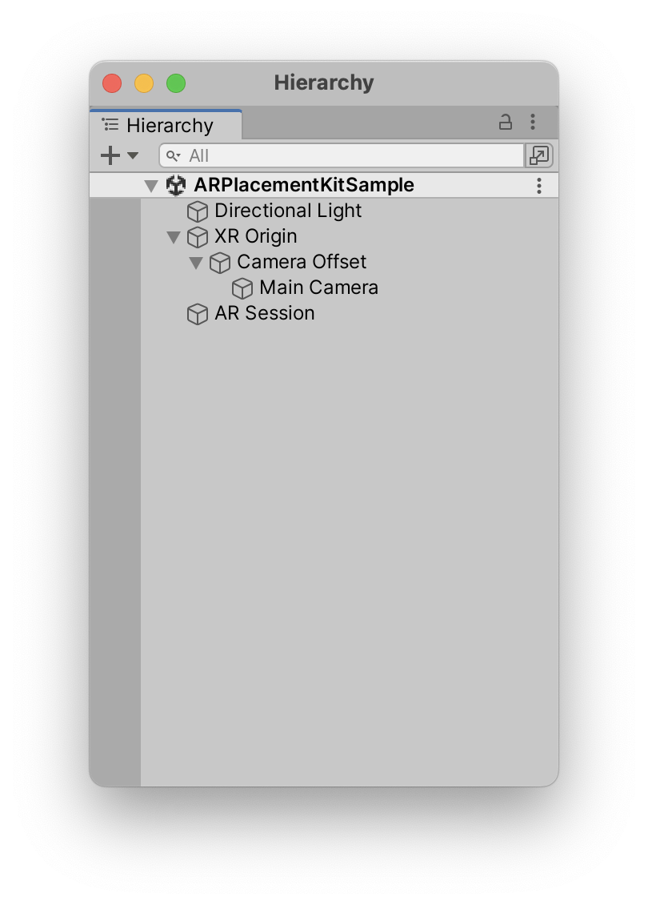

# Configuration

The two most important components of this package are the AR Placement Guide\* and the *Placeable Generator*. Both have to be on the same GameObject as the XR Origin.
It is best to check the sample scene for a working example.

{ width=400px }

Most settings can be found on those two components. In general your hierachy should look something like this:

{ width=400px, align=center }

If you are not using the sample scene as a starting point, you will have to add the *AR Placement Guide* and the *Placeable Generator* to the XR Origin GameObject.
As well as *AR Kit Coaching Overlay* to the *AR Session* GameObject (though this is optional as it is an iOS only feature).

## Placeable Generator

### Using your own model/prefab

By replacing the *Prefab* on the *Placeable Generator* in the inspector you can use your own prefab.
Just drag in your model and everything should work out of the box. The transform inside the prefab will be preserved.
Use the scale setting to change the initial scale of the object. It can still be resized during run-time using gestures.

{ width=400px, align=center }

This prefab should ideally only have a single *MeshRenderer* and a *MeshFilter* attached to it.

If your model is floating too high or is inside the ground, try to adjust the "Pivot Location" setting to match the pivot point position of your model.

A collider will also be added automatically. If you are unsure how to create a prefab, see the section below.
If you are looking for an example prefab check out the sample one.

#### Creating a prefab

!!! note

    If you know how to create a prefab, you can skip this section.

If you have a model that you want to use, you can create a prefab from it.
First import your model into Unity. Then select it in the Hierarchy and drag it into the Project window. This will create a prefab from the model.
This prefab can then be used in the *Placeable Generator*. Just select the XR Origin GameObject and drag the prefab into the *Prefab* field.

[More info on creating prefabs](https://docs.unity3d.com/Manual/CreatingPrefabs.html).

### Advanced Parameters

#### Min Scale

The smallest possible scale for the placeable when using the pinch gestures. When the scale is smaller or equal to this value, all instructions to reduce the placeable's scale are disregarded.

#### Transition Speed

The speed in which the placeable transitions between surfaces with different height levels.
Higher numbers lead to shorter transition time.

#### Transition Threshold

The minimum distance for a transition to be triggered. If the distance to the target position is smaller than this value, the movement will be instantaneous.
Raise this value if the placeable lags behind when dragging it with a finger gesture.
Higher values lead to fewer transitions.

#### Pivot Type

The y-location of the pivot point in your custom model.
Used for scaling.
Options are center and bottom, default is center.

## AR Placement Guide

{ width=400px, align=right, padding=30px }

### Enable Scaling

Enable scaling the placeable using a pinch gesture.

### Enable Rotation

Enable rotating the placeable by rotating the first 2 fingers that touch the screen around each other.

### Advanced Parameters

#### Debug mode

Enables additional logging and visual debugging tools.

#### Rotation speed

Set the multiplier for translating finger rotation into rotation of the placeable.

#### AR Plane Prefab

The visual representation for planes recognized by the AR System. Uses the default preset when not set.
