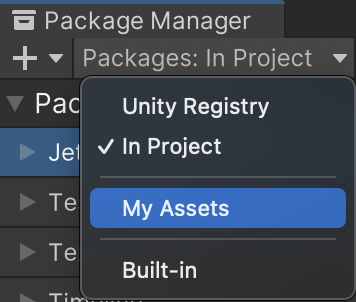
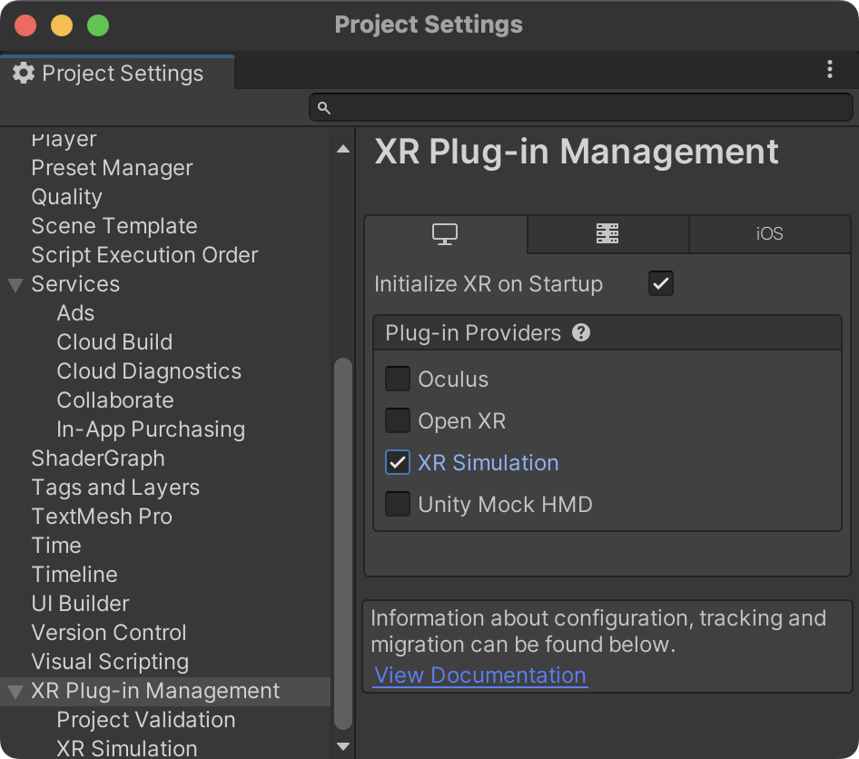

# Manual setup

!!! note

    If you used the template project from Github, you can skip this page.

## Creating a Unity project

It is recommended to start with a new project. The best option is to use the 3D (URP) starting template provided by Unity.

{ align=left, width=300px, class="shaded" }

## Installing the AR Placement Kit
In order for the package to work, there are a few important requirements:

- Your project must to use URP (Universal Render Pipeline)
- No version of AR Foundation below 5.0 is installed (When no version is installed, the package will do it)
- You are using Unity 2021.2 or above

Open `Window → Package Manager` and select `My Assets` from the drop-down list.
Download and import ARPlacementKit.

{ align=left, width=150px }

When installing the package from the package manager for the first time, you may be warned that the new input system is being used. Press *YES* to restart the editor.

{ align=left, width=300px }
{ align=left, width=200px, class="shaded"}

## Setting up AR Foundation

If you are starting a new project, you you will need to set up AR Foundation. AR Foundation is automatically installed by the Placement Kit because it is a dependency.
However, it is best to double check in the package manager that it is installed.

{ align=left, width=400px, class="shaded" }
{ align=left, width=400px, class="shaded" }

If for some reason you need to install AR Foundation manually, click on the plus sign in the upper right corner of the package manager and select `Add package by name...`. 
Enter the following information:

> Name: **com.unity.xr.arfoundation**
>
> Version: **5.0.3**

For more information, see the [ARFoundation Docs](https://docs.unity3d.com/Packages/com.unity.xr.arfoundation@5.0/manual/project-setup/project-setup.html).

### Setting up URP with AR Foundation

!!! note

    Skipping this step will result in a glitched image

AR Foundation does not work with URP out of the box.
You need to add an "AR Background Renderer Feature" to the renderer.
Choose `Assets → Settings → URP-Performant-Renderer.asset`. 

{ align=right, width=500px, class="shaded"}

In the Inspector click `Add Renderer Feature` and select `AR Background Renderer Feature`.

{ align=left, width=380px, class="shaded" }

Then, to make sure that the edited renderer is used, go to `Edit → Project Settings → Quality` and set the default quality to "Performant" for all profiles and set "Performant" as the active renderer by clicking on the name to the left of the checkboxes.

{ align=right, width=230px, class="shaded" }

Alternatively, follow [these steps](https://docs.unity3d.com/Packages/com.unity.xr.arfoundation@5.0/manual/project-setup/universal-render-pipeline.html) to set it up by creating the renderer from scratch.

### Setting up iOS (AR Kit)

First, enable ARKit in `Project Settings → XR Plugin-Management → iOS → ARKit`.

{ align=left, width=500px, class="shaded" }

Then, require support for it in iOS builds.

{ align=left, width=500px, class="shaded" }

Detailed instructions can be found in the [ARKit Docs](https://docs.unity3d.com/Packages/com.unity.xr.arkit@5.0/manual/project-configuration-arkit.html).

If you have any trouble setting up ARKit, meaning you can't build or get a black screen, take a look at the [Unity Manual for ARCore setup](https://docs.unity3d.com/Packages/com.unity.xr.arcore@5.0/manual/project-configuration-arcore.html).

Additionally, reduce code stripping for iOS by setting `Project Settings → Player → iOS → Managed Stripping Level` to "Minimal". For more information, see the [Unity Manual - Code Stripping](https://docs.unity3d.com/Manual/ManagedCodeStripping.html).

{ align=left, width=500px, class="shaded" }

!!! note

    Make sure that both ARFoundation and ARKit have the same version installed.

### Setting up Android (AR Core)

Follow the instructions in the [ARCore Docs](https://docs.unity3d.com/Packages/com.unity.xr.arcore@5.0/manual/project-configuration-arcore.html).

If you have trouble setting up ARCore, i.e. you can't build it or you get a black screen, take a look at the [Unity Manual for ARCore setup](https://docs.unity3d.com/Packages/com.unity.xr.arcore@5.0/manual/project-configuration-arcore.html).

### For testing inside the Unity Editor (optional)

- Go to `Project Settings → XR Plug-in Management` and check `XR Simulation`.

{ align=left, width=350px }

Add the `XR Environment` window from `Window → XR → AR Foundation → XR`.
Inside the `XR Environment`, Select `Install sample environments` from the drop-down list. After the installation has finished, click `Import sample environments`.

!!! note

    After loading a sample environment, if the XR Environment is glitched save the scene and restart the Unity Editor.

### Validation

It's recommended to validate your configuration. This can help to avoid errors later on.

{ align=left, width=550px }
{ align=left, width=550px, class="shaded" }

You can verify Android and iOS. Make sure everything is green before proceeding.

## Setting Tags and Layers

In order for the Placement Guide to work, you need to set up tags and layers in your project settings. The easiest way to do this is to import the preset from the package.

To do this, navigate to `Project Settings → Tags and Layers`, then click on the preset icon in the upper left corner of the window and select "Tags&Layers PlacementKit".

{ align=left, width=400px }
{ align=left, width=200px, class="shaded" }

!!! note

    WARNING! This will replace any existing tags or layers.

Alternatively, you can add the layers to your project manually. The order and index does not matter.

### Required Tags

- Placeable
- ReceiveShadows

### Required Layers

- RepositioningPlane
- Placeable
- SurfaceCollider
- PlaceableContactCollider
- CameraCollider

{ align=left, width=400px }
{ align=left, width=400px, class="shaded" }

## Setting up the scene
Simply open the demo scene from `Assets → ARPlacementKit → Samples → ARPlacingSample → ARPlacementKitSample.unity`.

### Manual Scene Setup
Alternatively, remove the MainCamera from the scene and add `XR Origin (mobile AR)` and `AR Session` from `GameObject → XR`.

{ width=400px, align=center }
{ width=200px, align=center, class="shaded" }

Then add the `ARPlacementGuide` from `Assets → ARPlacementKit → Scripts` to the `XR Origin` GameObject. It will automatically add the `PlaceableGenerator` as well. 

For a minimal configuration, drag and drop a Prefab into the `Prefab`-setting of the generator. You can use the sample Prefab located at `Assets → ARPlacementKit → Samples → ARPlacingSample → Cube`.
    
See also [Use your own model/Prefab](../configuration/#use-your-own-modelprefab).
    

## Text Mesh Pro
Add a `Text - TextMeshPro` GameObject from `GameObject → UI`.
A popup will ask you to import Text Mesh Pro into the project. Click on `Import TMP Essentials`.
When the import is finished, you can delete the `Canvas` GameObject including the nested `Text (TMP)` from the hierarchy.

!!! note

    This step is necessary because TMP is used at runtime. If you do not install it first, the import dialog will be triggered at runtime, and an import at this point will be undone when the simulation is stopped.

## Test the setup
Before customizing anything, make sure to press *Play* to see if everything works. Alternatively, create a build on your target device.
If you encounter any problems at this point, see the [troubleshooting](./troubleshooting.md) section.

After looking around and placing the object, it should look something like this:

{ align=left, width=200px }
{ align=left, width=200px , class="shaded" }

