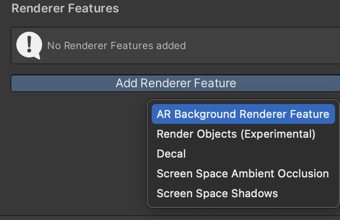

# Manual setup

!!! note

    If you used the template project from Github, you can skip this page.

## Creating a Unity project

It is recommended to start with a new project. The best option is to use the 3D (URP) starting template provided by Unity.

{ align=left, width=300px, class="shaded" }

## Installing the AR Placement Kit
In order for the package to work, there are a few important requirements:

- Your project must to use URP (Universal Render Pipeline)
- No version of AR Foundation below 5.0 is installed (When no version is installed, the package will do it)
- You are using Unity 2021.2 or above

When installing the package from the package manager for the first time, you may be warned that the new input system is being used. Press *YES* to restart the editor.

{ align=left, width=300px }
{ align=left, width=200px, class="shaded"}

After the editor has been restarted, you are ready to use the package. If at this point you encounter any errors related to the package, be sure to read the troubleshooting section. Again, a new project is the best way to make sure there are no conflicts with other packages.

## Setting up AR Foundation

If you are starting a new project, you you will need to set up AR Foundation. AR Foundation is automatically installed by the Placement Kit because it is a dependency.
However, it is best to double check in the package manager that it is installed.

{ align=left, width=400px, class="shaded" }
{ align=left, width=400px, class="shaded" }

Follow the *Install AR Foundation* and *Scene Setup* instructions in the [ARFoundation Docs](https://docs.unity3d.com/Packages/com.unity.xr.arfoundation@5.0/manual/project-setup/project-setup.html).
For package installation in Unity 2021, see [AR Foundation (Unity 2021)].

!!! note

    Make sure that both ARFoundation and ARKit have the same version installed.

### Setting up URP with AR Foundation

!!! note

    Skipping this step will result in a glitched image

AR Foundation does not work with URP out of the box.
You need to add an "AR Background Renderer Feature" to the renderer.
Choose **Assets -> Settings -> URP-Performant-Renderer.asset**. 

{ align=right, width=500px, class="shaded"}

In the Inspector click **Add Renderer Feature** and select **AR Background Renderer Feature**.

{ align=left, width=380px, class="shaded" }

Then, to make sure that the edited renderer is used, go to **Edit -> Project Settings -> Quality** and set the default quality to "Performant" for all profiles and set "Performant" as the active renderer by clicking on the name to the left of the checkboxes.

{ align=right, width=230px, class="shaded" }

Alternatively, follow [these steps](https://docs.unity3d.com/Packages/com.unity.xr.arfoundation@5.0/manual/project-setup/universal-render-pipeline.html) to set it up by creating the renderer from scratch.

### Setting up iOS (AR Kit)

First, enable ARKit in **Project Settings -> XR Plugin-Management -> iOS -> ARKit**.

{ align=left, width=500px, class="shaded" }

Then, require support for it in iOS builds.

{ align=left, width=500px, class="shaded" }

Detailed instructions can be found in the [ARKit Docs](https://docs.unity3d.com/Packages/com.unity.xr.arkit@5.0/manual/project-configuration-arkit.html).

If you have any trouble setting up ARKit, meaning you can't build or get a black screen, take a look at the [Unity Manual for ARCore setup](https://docs.unity3d.com/Packages/com.unity.xr.arcore@5.0/manual/project-configuration-arcore.html).

Additionally, reduce code stripping for iOS by setting **Project Settings -> Player -> iOS -> Managed Stripping Level** to "Minimal". For more information, see the [Unity Manual - Code Stripping](https://docs.unity3d.com/Manual/ManagedCodeStripping.html).

{ align=left, width=500px, class="shaded" }

### Setting up Android (AR Core)

Follow the instructions in the [ARCore Docs](https://docs.unity3d.com/Packages/com.unity.xr.arcore@5.0/manual/project-configuration-arcore.html).

If you have trouble setting up ARCore, i.e. you can't build it or you get a black screen, take a look at the [Unity Manual for ARCore setup](https://docs.unity3d.com/Packages/com.unity.xr.arcore@5.0/manual/project-configuration-arcore.html).

### For testing inside the unity editor (optional)

- Add the **XR Environment** window from **Window -> AR Foundation -> XR**
- inside the **XR Environment**, install the Sample Environments from the drop-down list

## Validation

It's recommended to validate your configuration. This can help to avoid errors later on.

{ align=left, width=550px }
{ align=left, width=550px, class="shaded" }

You can verify Android and iOS. Make sure everything is green before proceeding.

## Setting up Tags and Layers

In order for the Placement Guide to work, you need to set up tags and layers in your project settings. The easiest way to do this is to import the preset from the package.

To do this, navigate to **Project Settings -> Tags and Layers**, then click on the preset icon in the upper left corner of the window and select "Tags&Layers PlacementKit".

{ align=left, width=400px }
{ align=left, width=200px, class="shaded" }

!!! note

    WARNING! This will replace any existing tags or layers.

Alternatively, you can add the layers to your project manually. The order and index does not matter.

### Required Tags

- Placeable
- ReceiveShadows

### Required Layers

- RepositioningPlane
- Placeable
- SurfaceCollider
- PlaceableContactCollider
- CameraCollider

{ align=left, width=400px }
{ align=left, width=400px, class="shaded" }
