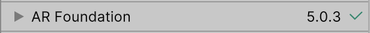
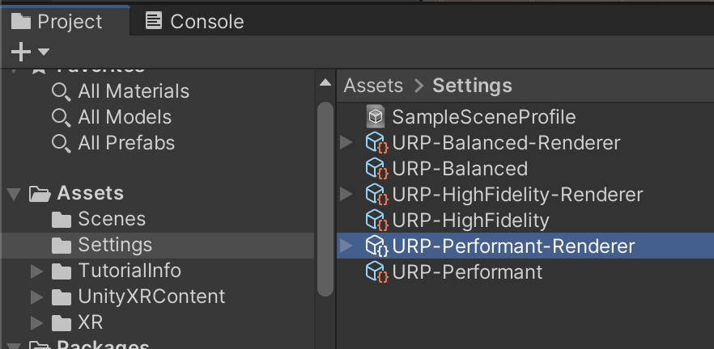
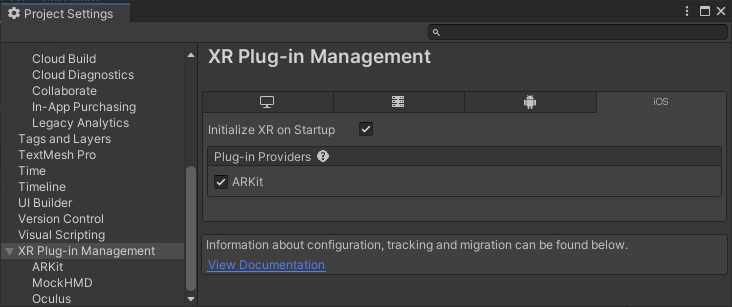
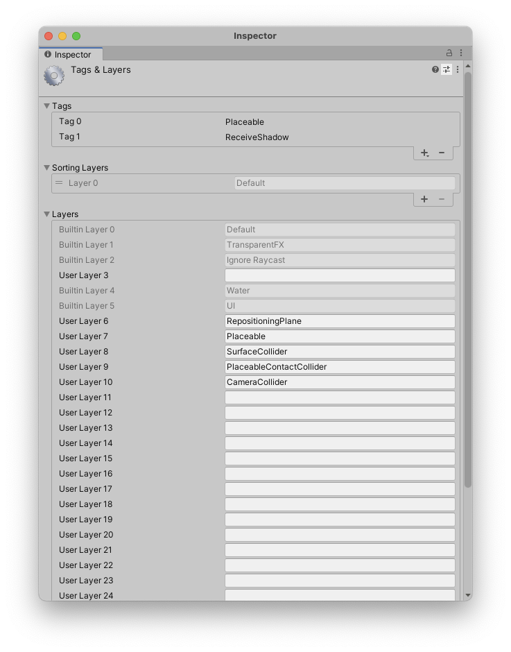

//# Manual Setup

## Manually Setting up AR Foundation

!!! note

    If you used the template project from Github, you can skip this section.

**It is recommended to start with a new project. The best option is to use the 3D (URP) starting template provided by Unity when starting a new project.**

{ align=left, width=300px }

In order for the package to work, there a few important requirements:

> - Your project needs to use URP (Universal Render Pipeline)
> - No version of AR Foundation below 5.0 is installed (When no version is installed, the package will do it)
> - You are using Unity 2021.2 or higher

When first installing the package from the package manager it might warn you that the new input system is used. Press *YES* to restart the editor.

{ align=left, width=300px }

After the editor has restarted, you can start using the package. If at this point there are any error related to the package, make sure to check it out the troubleshooting section. Again, a new project is the best way to make sure no conflicts with other packages are the problem.

!!! note

    This following part is only related to AR Foundation. It is the same whether you use AR Placement Kit or not. If you have experience setting AR Foundation you can skip this part. Also note that we provide a template project.

If you have started with a new project, you need to set up AR Foundation first. AR Foundation is will automatically be installed by the Placement Kit as it is an dependecy.
But it is best to double check in the package manager that it is installed.

{ align=left, width=400px }

Follow the *Install AR Foundation* and *Scene setup* instructions provided in the [ARFoundation Docs].
For package installation in Unity 2021, see [AR Foundation (Unity 2021)].

!!! note

    As stated in the Documentation, both ARFoundation and ARKit need to be set to the same version.

### Setup URP with AR Foundation

#### Setup URP with AR Foundation

AR Foundation does not work right away with URP.
You must add an "AR Background Renderer Feature" to the renderer.
The easiest way to do this, select Assets -> Settings -> URP-Performant-Renderer.asset and in the inspector click "Add Renderer Feature" and select "AR Background Renderer Feature".

{ align=left, width=500px }

{ align=left, width=380px }

Then, to make sure that the edited Renderer is used, go to Edit -> Project Settings -> Quality and set the default quality to "Performant" for all profiles and set "Performant" as the active renderer by clicking the name left of the checkboxes.

{ align=left, width=230px }

Alternatively, follow these [steps here to set it up](https://docs.unity3d.com/Packages/com.unity.xr.arfoundation@5.0/manual/project-setup/universal-render-pipeline.html). by creating the renderer from scratch.

!!! note

    Skipping this step will result in a glitched image

#### Setting up for iOS (AR Kit)

First, enable ARKit in Project Settings -> XR Plugin-Management -> iOS -> ARKit.

{ align=left, width=500px }

Then, require support for it in iOS builds.

{ align=left, width=500px }

Detailed instructions at [ARKit Docs].

!!! note

    You can either install for iOS or Android or both. If you just need a single platform, you can skip the other one.
    The AR scanning guide at the beginning is only available for iOS.

If you have any trouble setting up ARKit, meaning you can't build or get a black screen, take a look at the [Unity Manual for ARCore setup].

Additionally, reduce code stripping for iOS by setting \_Project Settings -> Player -> iOS -> Managed Stripping Level to "Minimal"\_. For more info see [Unity Manual - Code Stripping].

{ align=left, width=500px }

#### Setting up for Android (AR Core)

Follow the instructions from the [ARCore Docs].

If you have any trouble setting up ARCore, meaning you can't build or get a black screen, take a look at the [Unity Manual for ARCore setup].

#### Optional: For testing inside the unity editor

- Add the "XR Environment" window from Window -> AR Foundation -> XR
- inside the "XR Environment", install the Sample Environments from the drop-down

## Validate! Don't skip this

!!! note

    Don't miss this quick step. AR Foundation validates that every thing is set up correctly. If you skip this step, you might get errors later on.

{ align=left, width=550px }

You can check Android and iOS. Make sure everything is green.

## Setting up Tags and Layers

For the placement guide to function, appropriate Tags and Layers must be set in the Project Settings. The easiest way is to import the preset from the package.
To do this, navigate to Project Settings -> Tags and Layers, then click on the preset icon in the top left of the window and choose "Tags&Layers PlacementKit".

{ align=left, width=400px }

!!! note

    WARNING! This will replace any existing tags or layers.

Alternatively, you can manually add the layers to your Project. The order and index does not matter.

{ align=left, width=400px }

### Tags

- Placeable
- ReceiveShadows

### Layers

- RepositioningPlane
- Placeable
- SurfaceCollider
- PlaceableContactCollider
- CameraCollider
