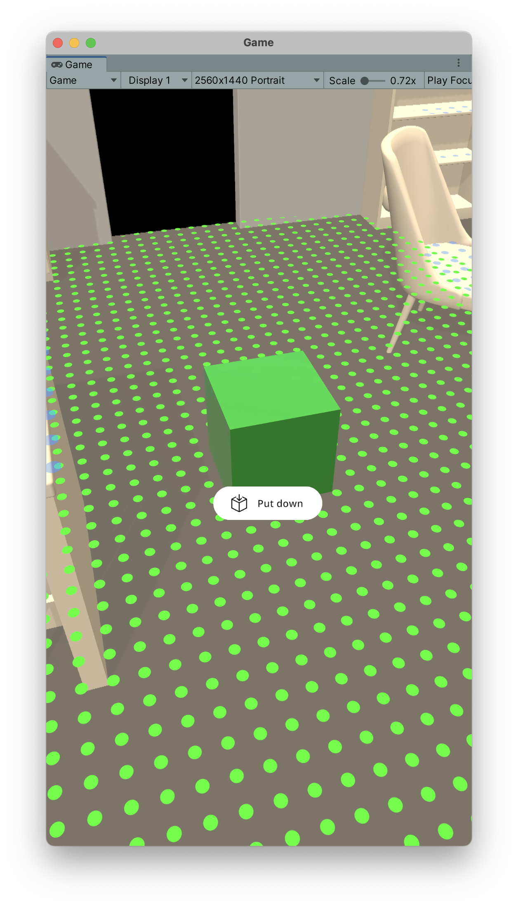

# Quick-start guide

## Using the template project

!!! note

    This is the fastest way if you are starting from scratch. It is also the best way to make sure that everything is set up correctly.

We provide a template project ready to use on Github. Make sure you have Unity Version 2021.2 or higher installed.

[Click here for the template project on Github](https://github.com/Ditached/Unity-ARFoundation-Template)

You can either download it using git but for this purpose, just download it as a zip from Github works perfectly fine.

{ align=left }

As it is a publicly accessible repo. The **AR Placement Kit is not included in the project**. You need to download it from the package manager.
You can skip the *Manually Setting up AR Foundation* section when using the template project. Just move on to the [SampleScenehttps://arplacementkit-docs.readthedocs.io/en/latest/installation.html#sample-scene](SampleScenehttps://arplacementkit-docs.readthedocs.io/en/latest/installation.html#sample-scene). section.

## XR Environment
### Select XR Environment Preset
### If Shaders are glitched
### Navigation
### Official Docs

## Import TMP Essentials
### Hit install

## Install ARPlacementKit
### Accept dependecies
### Import everything

## Sample Scene

## Set phone resolution in Game view

In the package there is a sample scene. It is located in the folder *Samples* in the package. It is called *ARPlacementKitSample*.
After opening it you should see the following hierachy:

{ align=left }

Before customizing anything, make sure to press *Play* if you have the *XR Simulation* enabled. Otherwise, create a build on your target device to validate that everything works.
If you run into any troubles at this point, check out the {doc}`troubleshooting` section.

It should something like this.

{ align=left }

!!! note

    If this is your first time using the *XR Simulation* make sure to check out the [documentation](https://docs.unity3d.com/Packages/com.unity.xr.arfoundation@5.0/manual/xr-simulation/simulation-getting-started.html).

The two finger gestures for rotating and scaling will only work on an actual device. The *XR Simulation** does not support it.

[ar foundation (unity 2021)]: https://docs.unity3d.com/Packages/com.unity.xr.arfoundation@5.0/manual/project-setup/edit-your-project-manifest.html
[arcore docs]: https://docs.unity3d.com/Packages/com.unity.xr.arcore@5.0/manual/project-configuration-arcore.html
[arfoundation docs]: https://docs.unity3d.com/Packages/com.unity.xr.arfoundation@5.0/manual/project-setup/project-setup.html
[arkit docs]: https://docs.unity3d.com/Packages/com.unity.xr.arkit@5.0/manual/project-configuration-arkit.html
[template project repo]: https://github.com/Ditached/Unity-ARFoundation-Template
[unity manual - code stripping]: https://docs.unity3d.com/Manual/ManagedCodeStripping.html
[unity manual for arcore setup]: https://docs.unity3d.com/Packages/com.unity.xr.arcore@5.0/manual/project-configuration-arcore.html
[unity manual for arkit setup]: https://docs.unity3d.com/Packages/com.unity.xr.arkit@5.0/manual/project-configuration-arkit.html
