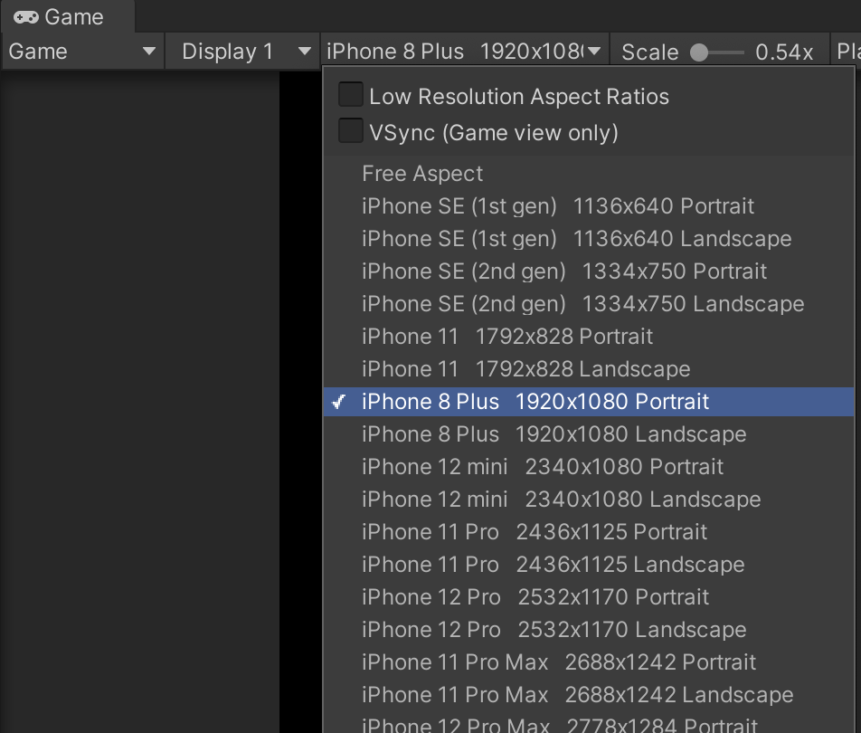

# Quick Start

This guide will use the provided template project for this package. If you want to integrate ARPlacementKit into an existing project, see [manual setup](../installation) instead.

!!! note

    This is the fastest way if you are starting from scratch. It is also the best way to make sure that everything is set up correctly.

## 1. Download the template project

We provide a ready-to-use template project on Github. Make sure you have Unity Version 2021.2 or higher installed.

[Download: Unity ARFoundation Template](https://github.com/Ditached/Unity-ARFoundation-Template)

You can clone it using git but for this purpose, just download it as a zip from Github.
After downloading, open the project with Unity (usually through Unity Hub).

{ align=left, width=300px , class="shaded" }

!!! note 

    As this is a publicly accessible repo, the **AR Placement Kit is not included in the project**. You need to download it using the Unity package manager.

## 2. Load the Sample Scene
Load the sample scene from `Assets -> Scenes -> SampleScene.unity`

## 3. Import TMP Essentials
A popup will open with a prompt to import Text Mesh Pro into the project. Click `Import TMP Essentials`.

## 4. XR Environment
Select XR Environment Preset in the `XR Environment` window (e.g. `Kitchen -> Kitchen_17ftx16ft`). 

{ align=left, width=300px , class="shaded" }

If there's no window titled "XR Environment", go to `Window -> XR -> AR Foundation -> XR Environment` to open it.

### Set resolution in Game view
To simulate a realistic aspect ratio and resolution, set the resolution from the drop-down menu in the Game View.

{ align=left, width=400px , class="shaded" }

### Navigation & Controls
To navigate the camera, hold down the right mouse button. Move with the keys W, A, S, D and turn the camera by moving the cursor. Clicks will translate to touch events. Moving the camera will trigger the recognition of surfaces.

!!! note

    The two finger gestures for rotating and scaling will only work on an actual mobile device. `XR Simulation` does not support it.

!!! note 

    In the example project, the simulated plane recognition is adjusted so surfaces get recognized faster. See `Project Settings -> XR Plug-In Management -> XR Simulation`.

{ align=left, width=400px , class="shaded" }

For more info see [XRSimulation Docs](https://docs.unity3d.com/Packages/com.unity.xr.arfoundation@5.1/manual/xr-simulation/simulation-environments.html).

### If Shaders are glitched
Sometimes, when opening an XR simulated environment for the first time, shaders are gliched. If that happens, restart the Unity Editor.

{ align=left, width=200px , class="shaded" }

Also see [Troubleshooting](./troubleshooting.md) and the [XRSimulation Docs](https://docs.unity3d.com/Packages/com.unity.xr.arfoundation@5.1/manual/xr-simulation/simulation.html).

## 5. Install ARPlacementKit
Select and install ARPlacementKit from the Unity Asset store.
A popup will appear, warning you about Package Manager dependecies. Click `Install/Upgrade`.
In the import dialogue, select everything and click `Import`.

Next, open the AR Placement Kit Sample Scene from `Assets -> AR Placement Kit -> Samples -> ARPlacingSample -> ARPlacementKitSample.untiy`.

After opening it you should see the following hierachy:

{ align=left, width=400px }
{ align=left, width=200px , class="shaded" }

!!! note

    If the XR Environment (e.g. the kitchen scene) is not visible in the XR Environment window, restart the Unity Editor again.

## 6. Test the setup
Before customizing anything, make sure to press *Play* to see if everything works. Alternatively, create a build on your target device.
If you run into any problems at this point, check out the [troubleshooting](./troubleshooting.md) section.

After looking around and placing the object, it should look something like this:

{ align=left, width=200px }
{ align=left, width=200px , class="shaded" }

