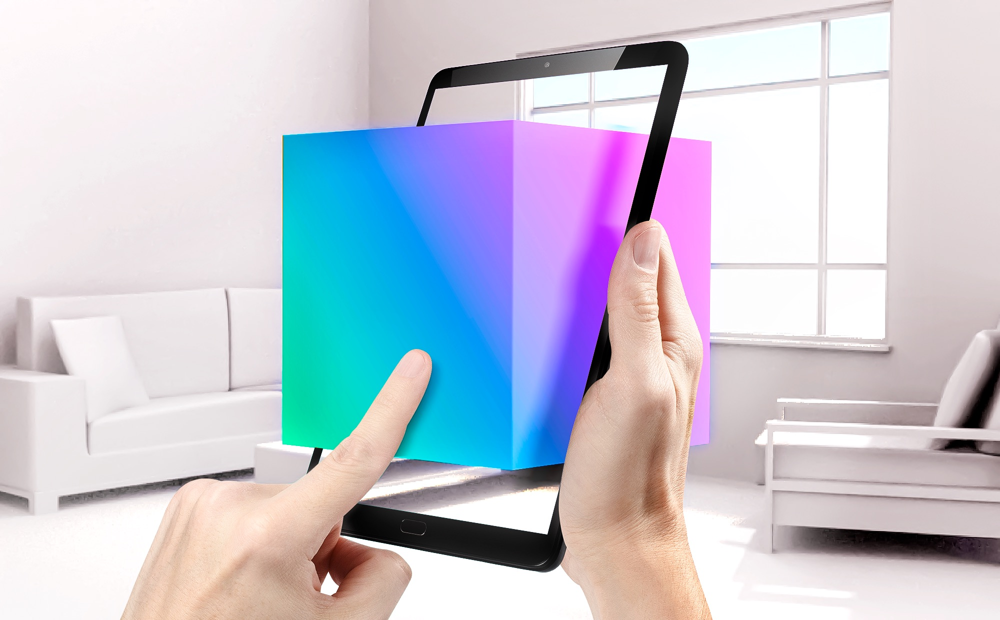

AR Placement Kit
===================================

**AR Placement Kit** provides an *intuitive* and *versatile* interface for positioning 3d objects inside an AR Space.

Features:
~~~~~~~~

    - Put any 3D Model into the AR Space without coding!
    - Smooth surface switching technology for the best AR positioning
    - Scaling and rotation with intuitive two-finger gestures
    - Additional high-precision interface for exact adjustments
    - Testing inside editor via AR Foundation 5.0+

Quick Start Guide:
~~~~~~~~
.. note::
    You can either use the video as tutorial or follow the :doc:`installation` section.

.. raw:: html

    <embed>
        <iframe width="560" height="315" src="https://www.youtube.com/embed/P2HiouySJG8" title="YouTube video player" frameborder="0" allow="accelerometer; autoplay; clipboard-write; encrypted-media; gyroscope; picture-in-picture; web-share" allowfullscreen></iframe>
        

        

    </embed>
   
 
**For a written guide** check out the :doc:`installation` section first!. If you got the package already setup and running, check out the :doc:`customization` section for a guide on how to work with the package.

If you are having trouble, check out the :doc:`troubleshooting` section.

.. note::
   Please follow the setup instructions carefully. Most errors occur by not setting up AR Foundation correctly, which is unrelated to this package. We provide some guide anyways to make sure you get started as easy as possible.
   
Why AR Foundation 5.0+:
~~~~~~~~
We decided to only support AR Foundation 5.0 as it is the newest version. There a major changes between versions and it is hard to support multiple of them.
Version 5.0+ provides support for in-editor testing which is essential for unintrrupted development.

Showcase
~~~~~~~~
.. raw:: html

    <embed>
        <iframe width="560" height="315" src="https://www.youtube.com/embed/P2HiouySJG8" title="YouTube video player" frameborder="0" allow="accelerometer; autoplay; clipboard-write; encrypted-media; gyroscope; picture-in-picture; web-share" allowfullscreen></iframe>
        

    </embed>

.. note::
   The coaching overlay at beginning is an AR Kit only feature, meaning it is on iOS exclusivly.
     
Contents
--------

.. toctree::

   installation
   customization
   usage
   troubleshooting
   about-us
