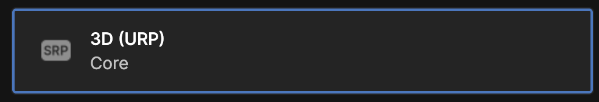
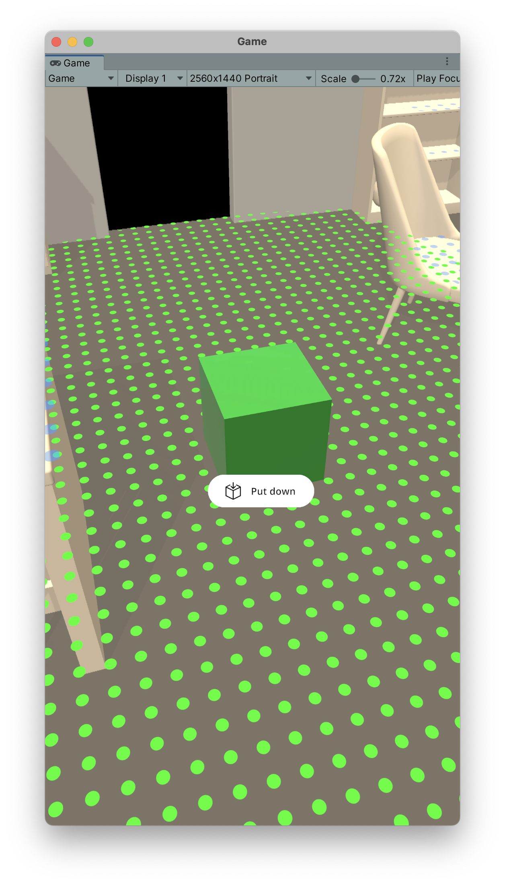

#####
Getting Started
#####
.. autosummary::
   :toctree: generated

=================
Recommended Way: Using the template project
=================

.. raw:: html

    <embed>
        <iframe width="560" height="315" src="https://www.youtube.com/embed/g8V4sUp5q_Q" title="YouTube video player" frameborder="0" allow="accelerometer; autoplay; clipboard-write; encrypted-media; gyroscope; picture-in-picture; web-share" allowfullscreen></iframe>
        

        

    </embed>

.. note::
   This is the fastest way if you are starting from scratch. It is also the best way to make sure that everything is set up correctly.

We provide a template project ready to use on Github. Make sure you have Unity Version 2021.2 or higher installed.

`Click here for the template project on Github <https://github.com/Ditached/Unity-ARFoundation-Template>`_

You can either download it using git but for this purpose, just download it as a zip from Github works perfectly fine.

.. image:: images/Github.png
    :width: 300

As it is a publicly accessible repo. The **AR Placement Kit is not included in the project**. You need to download it from the package manager.
You can skip the *Manually Setting up AR Foundation* section when using the template project. Just move on to the `<Sample Scene https://arplacementkit-docs.readthedocs.io/en/latest/installation.html#sample-scene>`_. section.

=================
Manually Setting up AR Foundation
=================

.. note::
   If you used the template project from Github, you can skip this section.

**It is recommended to start with a new project. The best option is to use the 3D (URP) starting template provided by Unity when starting a new project.**

In order for the package to work, there a few important requirements:

    - Your project needs to use URP (Universal Render Pipeline)
    - No version of AR Foundation below 5.0 is installed (When no version is installed, the package will do it)
    - You are using Unity 2021.2 or higher

When first installing the package from the package manager it might warn you that the new input system is used. Press *YES* to restart the editor.

.. image:: images/NewInputSystemPrompt.png
    :width: 300

After the editor has restarted, you can start using the package. If at this point there are any error related to the package, make sure to check it out the troubleshooting section. Again, a new project is the best way to make sure no conflicts with other packages are the problem.

.. note::
   This following part is only related to AR Foundation. It is the same whether you use AR Placement Kit or not. If you have experience setting AR Foundation you can skip this part. Also note that we provide a template project.

If you have started with a new project, you need to set up AR Foundation first. AR Foundation is will automatically be installed by the Placement Kit as it is an dependecy. 
But it is best to double check in the package manager that it is installed.

.. image:: images/ARFoundationPackage.png
    :width: 400

Follow the *Install AR Foundation* and *Scene setup* instructions provided in the `ARFoundation Docs`_.
For package installation in Unity 2021, see `AR Foundation (Unity 2021)`_.

.. note::
   As stated in the Documentation, both ARFoundation and ARKit need to be set to the same version.

Setup URP with AR Foundation
~~~~~~~~~~~~~~~~~~~~~~~~~~~~~~~~~~~~~~~
AR Foundation does not work right away with URP.
You must add an "AR Background Renderer Feature" to the renderer.
The easiest way to do this, select Assets -> Settings -> URP-Performant-Renderer.asset and in the inspector click "Add Renderer Feature" and select "AR Background Renderer Feature".

.. image:: images/RendererFile.png
    :width: 500
.. image:: images/RendererFeature.png
    :width: 380

Then, to make sure that the edited Renderer is used, go to Edit -> Project Settings -> Quality and set the default quality to "Performant" for all profiles and set "Performant" as the active renderer by clicking the name left of the checkboxes.
 

Alternatively, follow these `steps here to set it up <https://docs.unity3d.com/Packages/com.unity.xr.arfoundation@5.0/manual/project-setup/universal-render-pipeline.html>`_. by creating the renderer from scratch.

.. note::
   Skipping this step will result in a glitched image
   

Setting up for iOS (AR Kit)
~~~~~~~~~~~~~~~~~~~~~~~~~~~~~~~~~~~~~~~

First, enable ARKit in Project Settings -> XR Plugin-Management -> iOS -> ARKit.

.. image:: images/ARKitXRManagement.png
    :width: 500

Then, require support for it in iOS builds.

Detailed instructions at `ARKit Docs`_.

.. note::
   You can either install for iOS or Android or both. If you just need a single platform, you can skip the other one.
   The AR scanning guide at the beginning is only available for iOS.

If you have any trouble setting up ARKit, meaning you can't build or get a black screen, take a look at the `Unity Manual for ARCore setup`_. 

Additionally, reduce code stripping for iOS by setting _Project Settings -> Player -> iOS -> Managed Stripping Level to "Minimal"_. For more info see `Unity Manual - Code Stripping`_.

.. image:: images/CodeStripping.png
    :width: 500

Setting up for Android (AR Core)
~~~~~~~~~~~~~~~~~~~~~~~~~~~~~~~~~~~~~~~
Follow the instructions from the `ARCore Docs`_.

If you have any trouble setting up ARCore, meaning you can't build or get a black screen, take a look at the `Unity Manual for ARCore setup`_. 

Optional: For testing inside the unity editor
~~~~~~~~~~~~~~~~~~~~~~~~~~~~~~~~~~~~~~~
- Add the "XR Environment" window from Window -> AR Foundation -> XR 
- inside the "XR Environment", install the Sample Environments from the drop-down 

=================
Validate! Don't skip this
=================
.. note::
   Don't miss this quick step. AR Foundation validates that every thing is set up correctly. If you skip this step, you might get errors later on.

.. image:: images/Validation.png
    :width: 550

You can check Android and iOS. Make sure everything is green.

============
Sample Scene
============
In the package there is a sample scene. It is located in the folder *Samples* in the package. It is called *ARPlacementKitSample*.
After opening it you should see the following hierachy:

.. image:: images/Hierachy.png
    :width: 400

Before customizing anything, make sure to press *Play* if you have the *XR Simulation* enabled. Otherwise, create a build on your target device to validate that everything works.
If you run into any troubles at this point, check out the :doc:`troubleshooting` section.

It should something like this. 

.. note::
   If this is your first time using the *XR Simulation* make sure to check out the `documentation <https://docs.unity3d.com/Packages/com.unity.xr.arfoundation@5.0/manual/xr-simulation/simulation-getting-started.html>`_.

The two finger gestures for rotating and scaling will only work on an actual device. The *XR Simulation* does not support it.

==========================
Setting up Tags and Layers
==========================
For the placement guide to function, appropriate Tags and Layers must be set in the Project Settings. The easiest way is to import the preset from the package.
To do this, navigate to Project Settings -> Tags and Layers, then click on the preset icon in the top left of the window and choose "Tags&Layers PlacementKit".

           
.. note::
  WARNING! This will replace any existing tags or layers. 

Alternatively, you can manually add the layers to your Project. The order and index does not matter.

.. image:: images/Tags&Layers.png
    :width: 400
           
Tags
----
Placeable
ReceiveShadows

Layers
------
RepositioningPlane
Placeable
SurfaceCollider
PlaceableContactCollider
CameraCollider

    
            
.. _ARFoundation Docs: https://docs.unity3d.com/Packages/com.unity.xr.arfoundation@5.0/manual/project-setup/project-setup.html
.. _ARKit Docs: https://docs.unity3d.com/Packages/com.unity.xr.arkit@5.0/manual/project-configuration-arkit.html
.. _ARCore Docs: https://docs.unity3d.com/Packages/com.unity.xr.arcore@5.0/manual/project-configuration-arcore.html
.. _AR Foundation (Unity 2021): https://docs.unity3d.com/Packages/com.unity.xr.arfoundation@5.0/manual/project-setup/edit-your-project-manifest.html
.. _Unity Manual for ARCore setup: https://docs.unity3d.com/Packages/com.unity.xr.arcore@5.0/manual/project-configuration-arcore.html
.. _Unity Manual for ARKit setup: https://docs.unity3d.com/Packages/com.unity.xr.arkit@5.0/manual/project-configuration-arkit.html
.. _Unity Manual - Code Stripping: https://docs.unity3d.com/Manual/ManagedCodeStripping.html
.. _Template Project Repo: https://github.com/Ditached/Unity-ARFoundation-Template
