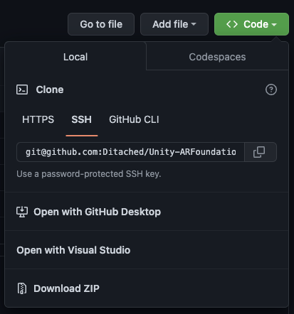
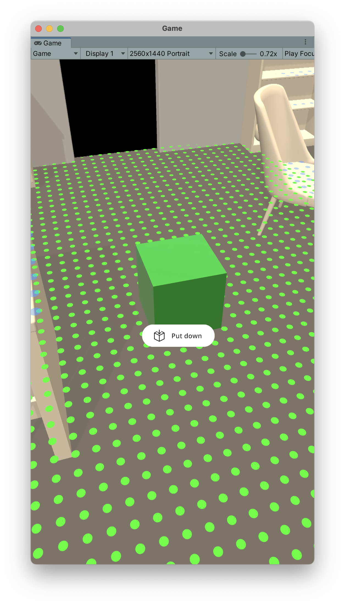

#################
Quick-start guide
#################
.. autosummary::
   :toctree: generated

==========================
Using the template project
==========================

.. raw:: html

    <embed>
        <iframe width="560" height="315" src="https://www.youtube.com/embed/g8V4sUp5q_Q" title="YouTube video player" frameborder="0" allow="accelerometer; autoplay; clipboard-write; encrypted-media; gyroscope; picture-in-picture; web-share" allowfullscreen></iframe>
        

        

    </embed>

.. note::
   This is the fastest way if you are starting from scratch. It is also the best way to make sure that everything is set up correctly.

We provide a template project ready to use on Github. Make sure you have Unity Version 2021.2 or higher installed.

`Click here for the template project on Github <https://github.com/Ditached/Unity-ARFoundation-Template>`_

You can either download it using git but for this purpose, just download it as a zip from Github works perfectly fine.

As it is a publicly accessible repo. The **AR Placement Kit is not included in the project**. You need to download it from the package manager.
You can skip the *Manually Setting up AR Foundation* section when using the template project. Just move on to the `<Sample Scene https://arplacementkit-docs.readthedocs.io/en/latest/installation.html#sample-scene>`_. section.

============
Sample Scene
============
In the package there is a sample scene. It is located in the folder *Samples* in the package. It is called *ARPlacementKitSample*.
After opening it you should see the following hierachy:

.. image:: images/Hierachy.png
    :width: 400

Before customizing anything, make sure to press *Play* if you have the *XR Simulation* enabled. Otherwise, create a build on your target device to validate that everything works.
If you run into any troubles at this point, check out the :doc:`troubleshooting` section.

It should something like this. 

.. note::
   If this is your first time using the *XR Simulation* make sure to check out the `documentation <https://docs.unity3d.com/Packages/com.unity.xr.arfoundation@5.0/manual/xr-simulation/simulation-getting-started.html>`_.

The two finger gestures for rotating and scaling will only work on an actual device. The *XR Simulation* does not support it.

    
            
.. _ARFoundation Docs: https://docs.unity3d.com/Packages/com.unity.xr.arfoundation@5.0/manual/project-setup/project-setup.html
.. _ARKit Docs: https://docs.unity3d.com/Packages/com.unity.xr.arkit@5.0/manual/project-configuration-arkit.html
.. _ARCore Docs: https://docs.unity3d.com/Packages/com.unity.xr.arcore@5.0/manual/project-configuration-arcore.html
.. _AR Foundation (Unity 2021): https://docs.unity3d.com/Packages/com.unity.xr.arfoundation@5.0/manual/project-setup/edit-your-project-manifest.html
.. _Unity Manual for ARCore setup: https://docs.unity3d.com/Packages/com.unity.xr.arcore@5.0/manual/project-configuration-arcore.html
.. _Unity Manual for ARKit setup: https://docs.unity3d.com/Packages/com.unity.xr.arkit@5.0/manual/project-configuration-arkit.html
.. _Unity Manual - Code Stripping: https://docs.unity3d.com/Manual/ManagedCodeStripping.html
.. _Template Project Repo: https://github.com/Ditached/Unity-ARFoundation-Template
