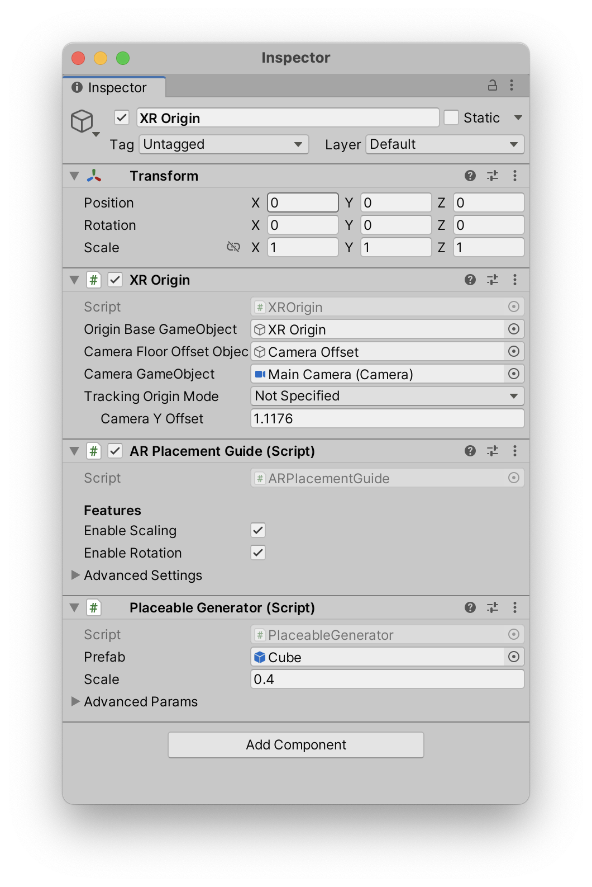
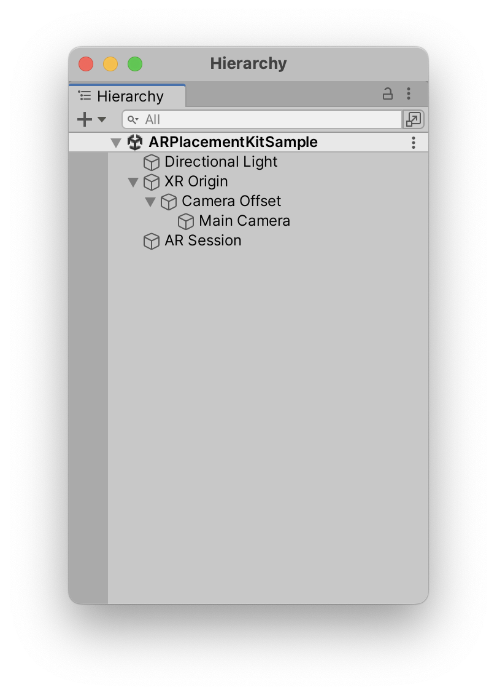

#####
Usage
#####
.. _usage:

The two most important components of this package are the **AR Placement Guide* and the *Placeable Generator*. Both have to be on the same GameObject as the XR Origin.
It is best to check the sample scene for a working example.

Most settings can be found on those two components. In general your hierachy should look something like this:

If you are not using the sample scene as a starting point, you will have to add the *AR Placement Guide* and the *Placeable Generator* to the XR Origin GameObject.
As well as *AR Kit Coaching Overlay* to the *AR Session* GameObject (though this is optional as it is an iOS only feature).

*******************
Placeable Generator
*******************

Using your own model/prefab
---------------------------
By replacing the *Prefab* on the *Placeable Generator* in the inspector you can use your own prefab.
Just drag in your model and everything should work out of the box. The transform inside the prefab will be preserved.
Use the scale setting to change the initial scale of the object. It can still be resized during run-time using gestures.

.. image:: images/CustomPrefab.png
    :width: 400

This prefab should ideally only have a single *MeshRenderer* and a *MeshFilter* attached to it.

A collider will also be added automatically. If you are unsure how to create a prefab, see the section below.
If you are looking for an example prefab check out the sample one. 

Creating a prefab
=================
.. note::
   If you know how to create a prefab, you can skip this section. 

If you have a model that you want to use, you can create a prefab from it.
First import your model into Unity. Then select it in the Hierarchy and drag it into the Project window. This will create a prefab from the model.
This prefab can then be used in the *Placeable Generator*. Just select the XR Origin GameObject and drag the prefab into the *Prefab* field.

`More info on creating prefabs <https://docs.unity3d.com/Manual/CreatingPrefabs.html>`_.

Advanced Parameters
===================

Collision Type
--------------
The type of collider used for collision detection.
For precision reasons its recommended to use the Mesh option, but as a fallback you can switch to Box when working with unoptimized meshes.

Ground Collider Scale
---------------------
The placeable uses a separate ground collider to determine if it is currently connected to the ground. Based on this, surface switching to lower surfaces is triggered.
A larger number means the placeable will stay on the higher surface longer before dropping down to the lower one, a smaller one will lead to an earlier surface change.

Ground Collider Scale
---------------------
The placeable uses a separate collider to determine if it is currently colliding with the camera. Based on this, the placeable will determine when to stop if it is moving towards the camera.
A larger number leads to a higher minimum distance, setting a very small number will enable the placeable to move into the camera or pass through it.

Transition Speed
----------------
The speed in which the placeable transitions between surfaces with different height levels.
Higher numbers lead to shorter transition time.

Transition Threshold
--------------------
The minimum distance for a transition to be triggered. If distance is smaller than this value, the movement will be instantaneous.
Raise this value if the placeable lags behind when dragging it with a finger gesture.
Higher values lead to fewer transitions.

Min Scale
---------
The smallest possible scale for the placeable when using the pinch gestures. When the scale is smaller or equal to this value, all instructions to reduce the placeable's scale are disregarded.

******************
AR Placement Guide
******************

Customization

==========

