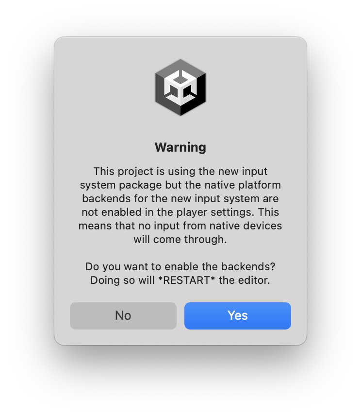

#####
Usage
#####

.. _usage:

Getting Started
===============

When first installing the package it might warn you that the new input system is used. Press *YES* to restart the editor.

Parameters
==========

Prefab
----------
A prefab containing the Mesh for the object. The tranform inside the prefab is preserved.

