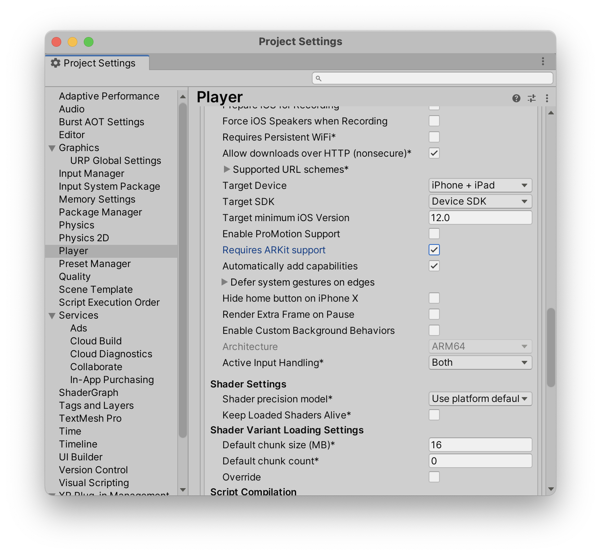
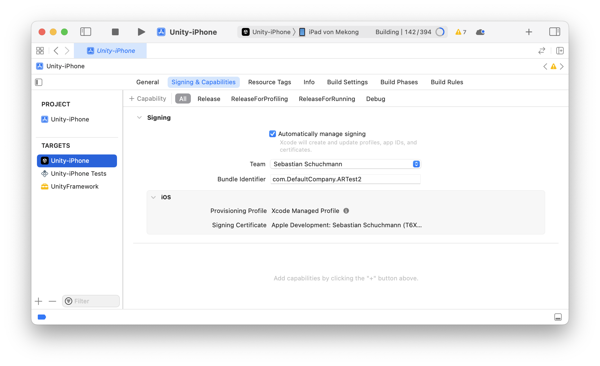

# Troubleshooting

!!! note

    Starting a new project and following the setup carefully should prevent all of the following errors.
    But this is still a good reference in case you missed a step.

## How do I install this package?

If you are having trouble installing the package, you can read [this guide from Unity](https://docs.unity3d.com/Manual/upm-ui-import.html).

## The image is black

This probably means that AR Foundation is not working properly. Make sure ARKit/ARCore is enabled in the project settings.

{ align=left, width=400px }

Next, make sure ARKit/ARCore is also enabled in the player settings.

{ align=left, width=400px }

For a comprehensive guide, you should read [this Unity guide](https://docs.unity3d.com/Packages/com.unity.xr.arfoundation@5.0/manual/project-setup/install-arfoundation.html).

## The image is glitched

If it looks like this

{ align=left, width=350px }

when deployed to your device, then URP is not set up with AR Foundation.
Follow these [steps here to fix it](https://docs.unity3d.com/Packages/com.unity.xr.arfoundation@5.0/manual/project-setup/universal-render-pipeline.html).

## Stuff is pink

If objects are rendered pink, you are probably not using URP (Universal Render Pipeline). Starting a new project with the 3D (URP) start template will prevent this problem. But it is also possible to upgrade.
For more information [see this guide](https://docs.unity3d.com/Packages/com.unity.render-pipelines.universal@15.0/manual/InstallURPIntoAProject.html).

## Threading error prevents building

This is a Unity related bug. Restarting the project seems to help.

## XCode error requiring provising profile

XCode requires a provising profile whenever you do a build. Setting XCode to automatically manage signing should work.

{ align=left, width=500px }

For more information, please refer to the Unity and/or XCode documentation.

## App crashes on Android

This is a problem with AR Foundation if you have e.g. Vulkan enabled.
Follow these [steps here to fix it](https://docs.unity3d.com/Packages/com.unity.xr.arcore@5.0/manual/project-configuration-arcore.html).

Another good way is to use the validation window. See [Validation](../installation/#validation).

## Object can not be moved

Set Project Settings -> Player -> iOS -> Managed Stripping Level to "Minimal". See [Setting up iOS (AR Kit)](../installation/#setting-up-ios-ar-kit).

## Object floats / is in the ground

Try adjusting the Pivot Type in Placeable Generator -> Advanced Settings. See [Pivot Type](../configuration/#pivot-type).

## No coaching overlay
The coaching overlay at the beginning is an AR Kit only feature, meaning it is exclusive to iOS.

## My problem is not listed here

B
Oh no! We apologize for that. We try to support you as best and as fast as we can. Drop us an email at <mailto:support@ditached.de> and we will try to help you.
Try adjusting the Pivot Type in Placeable Generator -> Advanced Settings. See [Configuration](../configuration/#pivot-type).

## No coaching overlay
The coaching overlay at the beginning is an AR Kit only feature, meaning it is exclusive to iOS.

## My problem is not listed here

Oh no! We apologize for that. We try to support you as best and as fast as we can. Drop us an email at <mailto:support@ditached.de> and we will try to help you.
