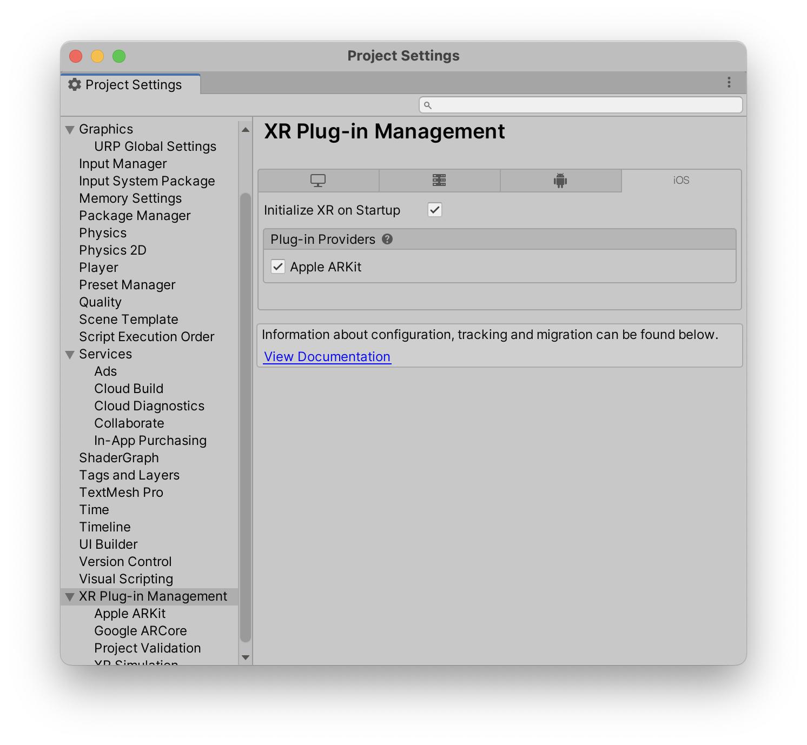
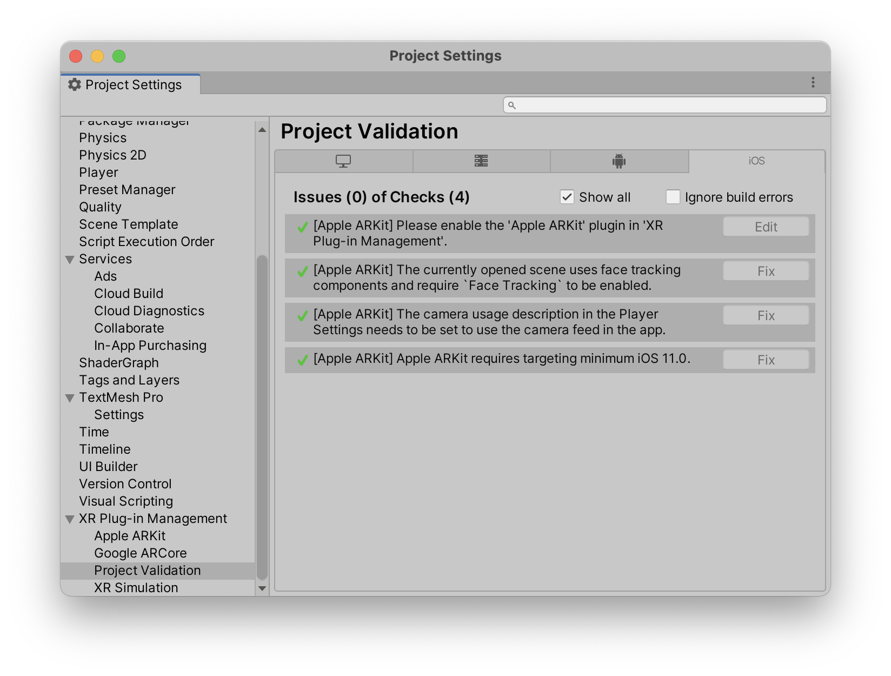

# Troubleshooting

## Common Errors

!!! note

    Starting a new project and following the setup carefully should prevent all of the following errors.
    But this is a great reference anyway if you may have missed a step.

### How do I install this package

If you have trouble installing the package, you can check out [this guide from Unity](https://docs.unity3d.com/Manual/upm-ui-import.html).

### The image is black

This probably means that AR Foundation is not working correctly. Make sure that ARKit/ARCore is enabled in the project settings.

{ align=left, width=400px }

Next, make sure in the Player Settings that ARKit/ARCore is enabled, too.

{ align=left, width=400px }

For a comprehensive guide, you should check out [this guide from Unity](https://docs.unity3d.com/Packages/com.unity.xr.arfoundation@5.0/manual/project-setup/install-arfoundation.html).

### The image is glitched

If it looks something like this

{ align=left, width=350px }

when deploying to your device, then URP is not setup with AR Foundation.
Follow these [steps here to fix it](https://docs.unity3d.com/Packages/com.unity.xr.arfoundation@5.0/manual/project-setup/universal-render-pipeline.html).

### Stuff is pink

When objects are rendered pink, you are probably not using the URP (Universal Render Pipeline). Starting the a new project with the 3D (URP) starting template will prevent this problem. But it is also possible to upgrade.
For more information [check out this guide](https://docs.unity3d.com/Packages/com.unity.render-pipelines.universal@15.0/manual/InstallURPIntoAProject.html).

### Threading error prevents building

This is a Unity related error. Restarting the project seems to help.

### XCode Error requiring provising profile

XCode requires a provising profile whenever you make an build. Setting XCode to automatically manage signing should work.

{ align=left, width=500px }

For further information make sure to check the Unity and or XCode docs.

### App is crashing on Android

This is a problem with AR Foundation if you have Vulkan enabled for example.
Follow these [steps here to fix it](https://docs.unity3d.com/Packages/com.unity.xr.arcore@5.0/manual/project-configuration-arcore.html).

Another great way is to use the validation window. Make sure everything is green here.

{ align=left, width=500px }

### If the object can be spawned but not moved

Set Project Settings -> Player -> iOS -> Managed Stripping Level to "Minimal". See [installation](./installation.md)

### If the object can be spawned but floats too high above the ground or is positioned below it

try adjusting the Pivot Position in Placeable Generator -> Advanced Settings.
See [Customization](./customization.md)

### I don't see a coaching overlay
The coaching overlay at beginning is an AR Kit only feature, meaning it is on iOS exclusivly.

### None of my errors is listed here

Oh no! We do apologize for that. We try to support you as best and as quick as we can. Drop us a mail at <mailto:support@ditached.de> and we will try to help you out.

